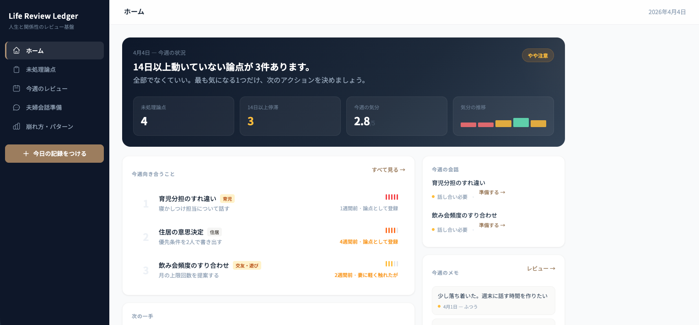

# Life Review Ledger — プロダクトガイド

---

## 仕事ではレビューできるのに、私生活では同じ失敗を繰り返してしまう人へ。

仕事で、論点を整理し、優先順位をつけ、実行し、振り返り、改善できる人にもかかわらず、家庭ではその実力が発揮されず、未処理の論点が積み上がり、同じ衝突を繰り返し、先送りが常態化している。

それは、その人がだらしないからではありません。
**私生活に「レビュー文化」が存在しないからです。**

Life Review Ledgerは、夫婦関係と家庭運営における未処理の論点を可視化し、対話と行動に接続する**人生運営レビュー基盤**です。


https://kyokara1031.sakura.ne.jp/life-review-ledger/

- ログインID：test1
- パスワード：test1

---

## このサービスが解く問題

| 仕事では当たり前にやっていること | 家庭ではなぜかできないこと |
|---|---|
| 商談前に論点を整理する | 夫婦の話し合い前に何も準備しない |
| 週次で振り返り、次のアクションを決める | 同じモヤモヤを何週間も放置する |
| 失敗をレビューし、再発防止策を立てる | 同じ衝突を何年も繰り返す |
| 判断の根拠を記録に残す | 感情で流して、何も残らない |

Life Review Ledgerは、この非対称を埋めます。
仕事で使っているレビューの力を、人生の土台である家庭運営に持ち込む仕組みです。

---

## 5つの画面、1つの基盤

### 1. ホーム — 今の状態を一目で把握する

ログインすると最初に目に入る画面です。
日記のトップページではなく、**家庭運営の状況把握ダッシュボード**です。

**表示されるもの：**
- 今週の状況メッセージ
- 未処理論点の件数と停滞日数
- 今週の気分推移グラフ
- 崩れ予兆レベル（安定 → やや注意 → 要注意）
- 今週向き合うべき論点（緊急度順トップ3）
- 次の一手（具体的なアクションチップ）

**なぜこの画面が必要か：**
「何となくやばい」を、「今どこが詰まっていて、何を前に進めるべきか」に変えるためです。

---

### 2. 未処理論点 — 家庭版バックログ

夫婦関係・家庭運営で「詰まっていること」を論点として管理する、このサービスの本丸です。

**各論点が持つ情報：**
- タイトル（例：育児分担のすれ違い）
- 領域（夫婦関係 / 育児 / お金 / 住居 / 働き方 など10分類）
- 緊急度（1-5）
- 感情温度（1-5）— データから自動推定もサジェスト
- 認識差（1-5）— 会話結果から自動推定もサジェスト
- ステータス（言語化前 → 話し合い必要 → 合意待ち → 実行中 → 解消）
- 次のアクション
- アクション履歴（タイムライン形式）

**アクション履歴とは：**
Asanaのアクティビティログのように、その論点に対して「いつ、何をしたか」が時系列で積み上がります。

例：
```
📌 3月6日  論点として登録
📝 3月13日 寝かしつけが3週連続で妻に偏っていることに気づいた
💬 3月20日 妻に「大変だよね」と声をかけた。深い話にはならず
😶 3月28日 日次振り返りで「今日向き合えなかった」と記録
🤝 4月2日  会話で合意: 週2回は自分が寝かしつけ担当に
```

これにより、何が積み上がっているか（完了履歴）と何が残っているか（次のアクション）が一目でわかります。「前に進んでいる」という実感が、継続の原動力になります。

**操作：**
- 「＋論点を追加」で新規登録
- カードをクリックで編集（ステータス変更、メトリクス更新、アクション追加）
- フィルター（領域・ステータス）とソート（緊急度・登録日・最終アクション日）で整理
- ホームの数字をクリックで「未処理のみ」「14日以上停滞のみ」にフィルタリング

---

### 3. 今日の振り返り — 2分で終わる日次レビュー

毎日の入力は**2分で終わる**設計です。日記ではなく、**家庭運営の日次デブリーフ**です。

**4ステップのウィザード形式：**

**Step 1: コンディション**
- 今日の気分（😭😟😐😄🥰 の5段階）
- 今日のシグナル（😤 衝突した / 😶 逃避した / 🤝 良い対話があった）

**Step 2: 先送りチェック**
- 未処理論点のリストから「今日向き合えなかったもの」をタップ
- → タップした論点のアクション履歴に「先送り」が自動記録される

**Step 3: 明日の一手**
- 「明日、家庭運営で1つだけやるとしたら？」
- 補足メモ（任意）

**Step 4: 確認 & 保存**
- 入力内容のサマリー表示
- 保存すると、ホーム・週次レビュー・崩れパターンすべてに自動反映

**なぜこの設計か：**
キーエンスの商談後レビューと同じ構造です。「何が起きた → 何が未処理 → 次どうする」。
感情を吐き出すためではなく、**来週どうするかに接続するため**に記録します。

---

### 4. 今週のレビュー — 1週間を構造化する

日次の記録を1週間単位で自動集計し、振り返り可能な形にまとめる画面です。

**自動集計されるセクション：**
- 今週の出来事（メモの日付順タイムライン）
- サマリー（平均気分 / 衝突日数 / 逃避日数 / 気分推移）
- 先送りした論点（どの論点を何回先送りしたか）
- 逃避があった日（メモ付き）
- 良い対話があった日
- 衝突があった日
- 今週立てた「明日の一手」の一覧
- 来週向き合うべきこと（緊急度上位の論点を自動取得）

**過去の週も振り返れる：**
- ← → ボタンで先週、2週前…と遡れる
- 日付をクリックでカレンダーから任意の週にジャンプ
- 「今週に戻る」ボタンでワンクリック復帰

**なぜこの画面が必要か：**
単なる振り返りではなく、「で、来週どうするのか」まで落とすためです。

---

### 5. 夫婦会話準備 — 話し合いの失敗を防ぐ

多くの人は、話し合いの"場"には行けても、**準備不足で失敗します**。
この画面は、会話の前に事実・感情・本音・ゴールを整理して臨むためのものです。

**準備シートに書くこと：**
- 話すテーマ
- 紐づく論点（未処理論点から選択）
- 今回の会話の目的
- 事実（客観的に起きていること）
- 感情（自分が感じていること）
- 自分が本当に伝えたいこと
- 言わない方がいい表現
- 相手が防御的になりやすいポイント
- 会話後に決めたいこと
- 予定日時

**会話後の記録（3パターン）：**
- 🤝 **合意できた** → 合意内容を記録、論点ステータスを「実行中」に自動変更
- ⚡ **一部のみ合意** → 合意内容＋次回アプローチを記録、ステータスを「合意待ち」に
- 🔄 **次回に継続** → わかったこと＋次回アプローチを記録

**論点への自動還元：**
会話の結果は、紐づいた論点のアクション履歴に自動で記録されます。
「合意内容」「気づき」「ステータス変更」がすべて自動で反映されるので、手動で転記する必要はありません。

**進行中 / 完了済みのタブ切り替え：**
完了した会話準備は「完了済み」タブに自動移動。画面がノイズにならず、過去の学びも振り返られます。

---

### 6. 崩れ方・反復パターン — 自分の取扱説明書

日次の記録が蓄積されると、あなたの**崩れやすい条件**と**うまくいきやすい条件**を自動で抽出します。

**自動抽出される例：**
- 「水曜日に崩れやすい（衝突・逃避が計5回）」
- 「衝突の翌日に逃避しやすい（3回）」
- 「疲労が溜まった日に崩れやすい（4回）」
- 「土曜日が最もうまくいきやすい（気分平均4.2）」
- 「先に自分から謝った時にうまくいく（3回）」
- 「衝突後、平均2日で回復する」

**データ量に応じた精度表示：**
- 各パターンに確信度（●●○ 3段階）と根拠（実際のメモ引用）を表示
- 分析対象の日数と精度レベル（低/中/高）を明示

**手動追加も可能：**
自動抽出だけでなく、自分で気づいたパターンを手動で追加・削除できます。

**なぜこの画面が必要か：**
これは単なる記録ではなく、「自分はどういう夫・父・生活運営者なのか」を学習する画面です。
データが増えるほど、あなた専用の家庭運営データベースが育っていきます。

---

## データの流れ

Life Review Ledgerのすべての画面は、**1つのデータ基盤**でつながっています。

```
今日の振り返り（日次入力）
    │
    ├─→ ホーム ─── 気分推移・崩れ予兆・今週のメモ
    │
    ├─→ 週次レビュー ─── 全セクション自動集計
    │
    ├─→ 未処理論点 ─── 先送り記録がアクション履歴に自動追加
    │
    ├─→ 崩れパターン ─── 衝突/逃避/気分の傾向を自動分析
    │
    └─→ 夫婦会話準備 ─── 会話結果が論点に自動還元
```

バラバラのメモではなく、**すべてが接続された人生運営の基盤**です。

---

## 使い方ガイド

### 初日
1. ログインする
2. ホーム画面で状況を確認する
3. 「＋論点を追加」で、今気になっている論点を2〜3個登録する
4. 「＋今日の記録をつける」で初回の振り返りをする

### 毎日（2分）
1. 「＋今日の記録をつける」をタップ
2. 気分を選ぶ → シグナルを選ぶ → 先送り論点をチェック → 明日の一手を書く
3. 保存

### 週末（10分）
1. 「今週のレビュー」で1週間を振り返る
2. 先送りが多い論点を確認する
3. 話し合いが必要な論点があれば「夫婦会話準備」を作成する

### 話し合いの前
1. 「夫婦会話準備」で事実・感情・本音・ゴールを整理する
2. 言わない方がいい表現、相手の地雷を確認する

### 話し合いの後
1. 結果を記録する（合意 / 一部合意 / 継続）
2. 論点のアクション履歴に自動反映される

### 1ヶ月後
1. 「崩れ方・パターン」で自分の傾向を確認する
2. 崩れやすい曜日・条件を把握し、予防に活かす
3. うまくいく条件を意識的に再現する

---

## 誰のためのサービスか

**Life Review Ledgerは、以下のような人のためにつくられています。**

- 結婚や家庭を軽く扱っていない
- いい夫・いい父でありたいと思っている
- でも、夫婦関係や家庭運営がうまくいっていない
- 感情論ではなく、整理と実装で立て直したい
- 仕事ではできるのに、家庭では同じ失敗を繰り返してしまう

**このサービスがつくりたい未来：**

結婚や家庭に対して誠実でありたいのに、うまく実装できない人が、
自分の人生と関係性をレビュー可能な資産として残し、
家庭と生活基盤を立て直していける社会。

出会いを支えるサービスは増えた。
でも、**家庭を続けること、人生の基盤を壊さずに運営すること**を支える基盤は、まだ少ない。

Life Review Ledgerは、その空白を埋めるプロダクトです。

---

## 今後の展開

### 4週間プログラムとの連携
本プロダクトは、単体のセルフケアアプリではありません。
**4週間の人生運営レビュー実装プログラム**の中核ツールとして設計されています。

- 初回90分の設計セッション
- 毎日2分のチェックイン（本プロダクトの日次振り返り）
- 週1回45分のレビュー（本プロダクトの週次レビューをベースに）
- 今週やるべき重要会話・行動の固定
- 最終回で「崩れ方」と「再発防止基準」を言語化

プロダクトが記録・可視化・検知を担い、
人が**レビュアーとして介入し、逃避を止め、実行を前に進める**。
この組み合わせにより、AIや日記では到達できない「現実の行動変化」が起きます。

### 継続インフラとしての設計
4週間で終わりではなく、**人生運営の継続基盤**として残り続けます。

育児、住居、働き方、家計、夫婦の役割分担——
この層の私生活には、毎月のように重い判断が発生します。
そのたびに使えるレビュー基盤であること。
自分の反復パターンが蓄積され、再利用できる資産になること。
それがLife Review Ledgerの本質です。

---

## 技術スタック

### フロントエンド

| 技術 | 用途 |
|---|---|
| HTML / PHP | ページ構造・ルーティング・サーバーサイド処理 |
| Tailwind CSS（CDN版） | ユーティリティベースのスタイリング |
| カスタムCSS（style.css） | コンポーネント固有のスタイル（1ファイルに統合） |
| Vanilla JavaScript | 画面描画・操作・データ管理（フレームワーク不使用） |
| Noto Sans JP（Google Fonts） | 日本語フォント |

### データ管理

| 技術 | 用途 |
|---|---|
| LocalStorage | クライアント側データ永続化（オフライン対応・キャッシュ） |
| MySQL 8.0 | サーバー側データベース（さくらサーバー） |
| PHP API | LocalStorage ↔ MySQL の同期エンドポイント |

### インフラ

| 技術 | 用途 |
|---|---|
| さくらサーバー（スタンダード） | 本番ホスティング（Apache + PHP + MySQL） |
| XAMPP | ローカル開発環境 |

### 設計方針
- **フレームワークレス**: React / Vue 等を使わず、Vanilla JS + PHP のシンプル構成。さくらサーバーの共有ホスティングでそのまま動作
- **LocalStorage ファースト**: DB未接続でも全機能が動作。DB接続時はAPIを通じて自動同期
- **モバイルフレンドリー**: 全画面レスポンシブ対応。iOS のズーム防止、タッチターゲットサイズ確保

---

## セキュリティ対策

本プロダクトでは、OWASP Top 10 を参照し、以下のセキュリティ対策を実装しています。

### 認証・セッション管理

| 対策 | 実装内容 |
|---|---|
| パスワードハッシュ化 | bcrypt（`password_hash` / `password_verify`）で保存・検証。平文パスワードは保持しない |
| セッション固定攻撃対策 | ログイン成功時に `session_regenerate_id(true)` でセッションIDを再生成 |
| セッションCookie保護 | `httponly`（JSからアクセス不可）、`samesite=Strict`（CSRF防止）、HTTPS時は`secure`フラグ |
| 不正セッション拒否 | `session.use_strict_mode` 有効化 |
| セッション有効期限 | 2時間で自動期限切れ |
| ブルートフォース防止 | ログイン試行回数制限（5回 / 5分間） |

### クロスサイト攻撃対策

| 対策 | 実装内容 |
|---|---|
| XSS防止（サーバー側） | すべてのユーザーデータ出力に `htmlspecialchars()` を適用 |
| XSS防止（クライアント側） | `innerHTML` で描画するすべてのユーザーデータにグローバル `esc()` 関数を適用。`textContent` ベースでエスケープ |
| CSRF防止 | ログインフォームにCSRFトークン（`random_bytes(32)`）を埋め込み、送信時にサーバー側で `hash_equals()` により検証 |

### データベースセキュリティ

| 対策 | 実装内容 |
|---|---|
| SQLインジェクション防止 | 全クエリでPDOプリペアドステートメント（パラメータバインド）を使用。文字列結合によるSQL構築は一切なし |
| エラーメッセージ制御 | 例外の詳細はサーバーログに記録（`error_log`）。クライアントには汎用メッセージのみ返却 |

### HTTPセキュリティ

| 対策 | 実装内容 |
|---|---|
| X-Content-Type-Options | `nosniff` — MIMEスニッフィング防止 |
| X-Frame-Options | `DENY` — クリックジャッキング防止 |
| X-XSS-Protection | `1; mode=block` — ブラウザXSSフィルター有効化 |

### アクセス制御

| 対策 | 実装内容 |
|---|---|
| ページ認証 | 全ページでログイン状態を検証。未認証ユーザーはログイン画面にリダイレクト |
| API認証 | 全APIエンドポイントでセッション認証を検証。未認証リクエストは401を返却 |
| 入力バリデーション | ページパラメータの正規表現検証（`/^[a-z\-]+$/`）、ログインIDの長さ制限、APIアクション名の検証 |
| ルーティング保護 | ホワイトリスト方式（`$validPages`配列に定義されたページのみアクセス可能） |

---

*Life Review Ledger — 人生と関係性のレビュー基盤*
